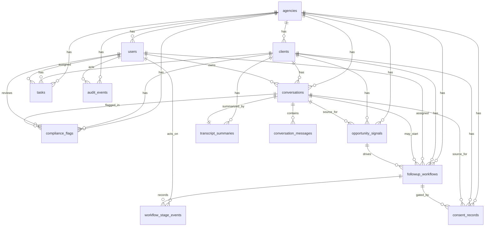

# DATABASE_SCHEMA

## Purpose
This document defines a Postgres-ready schema for the compliance-first Medicare agency operations app. It is designed to match the current product behavior while staying ready for a real persistence layer.

Design goals:
- preserve strict separation between Medicare operations and separate retirement-income follow-up
- keep consent, workflow blockers, and auditability explicit
- support human-in-the-loop review rather than autonomous recommendations
- map closely to the current fake data and route behavior

## Modeling Notes
- Use `uuid` primary keys in production even though the fake data currently uses readable string ids.
- Prefer Postgres enums or constrained `text` columns for status/category fields.
- Use `jsonb` only for flexible metadata, not core workflow fields.
- Store all timestamps as `timestamptz`.
- Keep Medicare workflow fields and separate follow-up workflow fields distinct, even when they relate to the same client or conversation.

## Recommended Enum Values

### user_role
- `manager`
- `agent`
- `service`
- `compliance`

### license_type
- `none`
- `medicare_only`
- `life_health`
- `series65_plus`

### client_status
- `new_to_medicare`
- `active_review`
- `service_only`
- `watch`

### preferred_contact_method
- `phone`
- `email`
- `text`

### conversation_channel
- `phone`
- `web_intake`
- `service_call`

### conversation_status
- `new`
- `in_review`
- `routed`
- `closed`

### conversation_routing_state
- `awaiting_review`
- `ready_to_route`
- `blocked`
- `complete`

### consent_status
- `granted`
- `revoked`
- `pending`
- `expired`

### consent_product_category
- `medicare`
- `separate_retirement_follow_up`

### flag_severity
- `low`
- `medium`
- `high`
- `critical`

### flag_status
- `open`
- `resolved`
- `dismissed`

### task_queue
- `intake`
- `service`
- `compliance`
- `follow_up`

### task_status
- `open`
- `in_progress`
- `blocked`
- `done`

### task_priority
- `low`
- `normal`
- `high`
- `urgent`

### workflow_status
- `detected`
- `awaiting_consent`
- `ready_for_assignment`
- `assigned`
- `completed`
- `closed_no_action`

### workflow_stage_code
- `signal_detected`
- `needs_review`
- `consent_requested`
- `consent_captured`
- `assigned_to_licensed_producer`
- `appointment_scheduled`
- `completed`
- `closed_not_interested`

## Tables

### agencies
Purpose:
- top-level tenant for all operational data

Primary key:
- `id uuid primary key`

Columns:
- `id uuid not null`
- `name text not null`
- `slug text not null`
- `timezone text not null`
- `region text`
- `created_at timestamptz not null default now()`
- `updated_at timestamptz not null default now()`

Foreign keys:
- none

Recommended indexes:
- `unique index agencies_slug_key on agencies(slug)`

Important constraints:
- `slug` must be unique

### users
Purpose:
- internal staff and reviewers who act in the system

Primary key:
- `id uuid primary key`

Columns:
- `id uuid not null`
- `agency_id uuid not null`
- `full_name text not null`
- `role user_role not null`
- `license_type license_type not null`
- `email citext not null`
- `team text`
- `is_active boolean not null default true`
- `created_at timestamptz not null default now()`
- `updated_at timestamptz not null default now()`

Foreign keys:
- `agency_id references agencies(id)`

Recommended indexes:
- `index users_agency_id_idx on users(agency_id)`
- `unique index users_agency_id_email_key on users(agency_id, email)`
- `index users_role_idx on users(role)`

Important constraints:
- email must be unique per agency

### clients
Purpose:
- beneficiary/customer record used across conversations, consent, compliance, and follow-up

Primary key:
- `id uuid primary key`

Columns:
- `id uuid not null`
- `agency_id uuid not null`
- `first_name text not null`
- `last_name text not null`
- `dob date not null`
- `phone text`
- `email citext`
- `state text not null`
- `preferred_contact_method preferred_contact_method`
- `status client_status not null`
- `tags text[] not null default '{}'`
- `note text`
- `created_at timestamptz not null default now()`
- `updated_at timestamptz not null default now()`

Foreign keys:
- `agency_id references agencies(id)`

Recommended indexes:
- `index clients_agency_id_idx on clients(agency_id)`
- `index clients_status_idx on clients(status)`
- `index clients_name_idx on clients(agency_id, last_name, first_name)`
- `index clients_tags_gin_idx on clients using gin(tags)`

Important constraints:
- at least one of phone or email should typically exist for operational use

### conversations
Purpose:
- top-level intake, service, review, or follow-up conversation record

Primary key:
- `id uuid primary key`

Columns:
- `id uuid not null`
- `agency_id uuid not null`
- `client_id uuid not null`
- `owner_user_id uuid`
- `channel conversation_channel not null`
- `status conversation_status not null`
- `started_at timestamptz not null`
- `ended_at timestamptz`
- `summary text`
- `medicare_scope text not null`
- `routing_state conversation_routing_state not null`
- `detected_topics text[] not null default '{}'`
- `retirement_interest_detected boolean not null default false`
- `next_step text`
- `is_separate_follow_up_only boolean not null default false`
- `created_at timestamptz not null default now()`
- `updated_at timestamptz not null default now()`

Foreign keys:
- `agency_id references agencies(id)`
- `client_id references clients(id)`
- `owner_user_id references users(id)`

Recommended indexes:
- `index conversations_agency_id_idx on conversations(agency_id)`
- `index conversations_client_id_idx on conversations(client_id)`
- `index conversations_owner_user_id_idx on conversations(owner_user_id)`
- `index conversations_started_at_idx on conversations(started_at desc)`
- `index conversations_status_routing_idx on conversations(status, routing_state)`
- `index conversations_topics_gin_idx on conversations using gin(detected_topics)`

Important constraints:
- if `is_separate_follow_up_only = true`, the record should not be treated as a Medicare sales conversation
- if `retirement_interest_detected = true`, downstream logic should create only a separate, consented workflow rather than altering Medicare guidance

### conversation_messages
Purpose:
- ordered transcript entries/messages within a conversation

Primary key:
- `id uuid primary key`

Columns:
- `id uuid not null`
- `conversation_id uuid not null`
- `speaker_type text not null`
- `speaker_name text not null`
- `utterance text not null`
- `spoken_at timestamptz not null`
- `sequence_number integer not null`
- `created_at timestamptz not null default now()`

Foreign keys:
- `conversation_id references conversations(id) on delete cascade`

Recommended indexes:
- `index conversation_messages_conversation_id_idx on conversation_messages(conversation_id, sequence_number)`
- `unique index conversation_messages_conversation_seq_key on conversation_messages(conversation_id, sequence_number)`

Important constraints:
- `sequence_number > 0`
- sequence number must be unique within a conversation

### transcript_summaries
Purpose:
- deterministic or future AI-generated summary artifacts tied to a conversation

Primary key:
- `id uuid primary key`

Columns:
- `id uuid not null`
- `conversation_id uuid not null`
- `client_id uuid not null`
- `created_at timestamptz not null`
- `summary text not null`
- `client_intent text`
- `detected_topics text[] not null default '{}'`
- `compliance_review_status text not null`
- `consent_status text not null`
- `key_facts jsonb not null default '[]'::jsonb`
- `unresolved_items jsonb not null default '[]'::jsonb`
- `recommended_next_action text`
- `analysis_version text`

Foreign keys:
- `conversation_id references conversations(id) on delete cascade`
- `client_id references clients(id)`

Recommended indexes:
- `unique index transcript_summaries_conversation_id_key on transcript_summaries(conversation_id)`
- `index transcript_summaries_client_id_idx on transcript_summaries(client_id)`
- `index transcript_summaries_detected_topics_gin_idx on transcript_summaries using gin(detected_topics)`

Important constraints:
- summary rows should be tied to exactly one conversation

### consent_records
Purpose:
- auditable consent ledger across Medicare permissions and separate follow-up permissions

Primary key:
- `id uuid primary key`

Columns:
- `id uuid not null`
- `agency_id uuid not null`
- `client_id uuid not null`
- `conversation_id uuid`
- `followup_workflow_id uuid`
- `opportunity_signal_id uuid`
- `consent_type text not null`
- `product_category consent_product_category not null`
- `channel text not null`
- `status consent_status not null`
- `disclosure_version text not null`
- `captured_at timestamptz not null`
- `source text not null`
- `capture_method text not null`
- `evidence_ref text`
- `evidence_complete boolean not null default false`
- `captured_by_user_id uuid`
- `notes text`
- `metadata jsonb not null default '{}'::jsonb`
- `created_at timestamptz not null default now()`
- `updated_at timestamptz not null default now()`

Foreign keys:
- `agency_id references agencies(id)`
- `client_id references clients(id)`
- `conversation_id references conversations(id)`
- `followup_workflow_id references followup_workflows(id)`
- `opportunity_signal_id references opportunity_signals(id)`
- `captured_by_user_id references users(id)`

Recommended indexes:
- `index consent_records_client_id_idx on consent_records(client_id, captured_at desc)`
- `index consent_records_conversation_id_idx on consent_records(conversation_id)`
- `index consent_records_followup_workflow_id_idx on consent_records(followup_workflow_id)`
- `index consent_records_status_idx on consent_records(status)`
- `index consent_records_product_category_idx on consent_records(product_category)`

Important constraints:
- must capture `product_category`, `channel`, `disclosure_version`, `captured_at`, `source`, and `conversation_id` when applicable
- if `product_category = 'separate_retirement_follow_up'`, then `consent_type` must represent only separate follow-up permission, not Medicare permission
- if `status = 'granted'`, `evidence_complete` should normally be true
- a separate follow-up workflow cannot be treated as consent-cleared unless a related `consent_records` row exists with `product_category = 'separate_retirement_follow_up'`, `status = 'granted'`, and `evidence_complete = true`

### compliance_flags
Purpose:
- reviewer and system flags raised against conversations

Primary key:
- `id uuid primary key`

Columns:
- `id uuid not null`
- `agency_id uuid not null`
- `conversation_id uuid not null`
- `client_id uuid not null`
- `flag_type text not null`
- `severity flag_severity not null`
- `status flag_status not null default 'open'`
- `rule_key text`
- `rationale text not null`
- `recommended_action text`
- `detected_by text not null`
- `assigned_user_id uuid`
- `flagged_at timestamptz not null`
- `resolved_at timestamptz`
- `resolution_note text`
- `metadata jsonb not null default '{}'::jsonb`

Foreign keys:
- `agency_id references agencies(id)`
- `conversation_id references conversations(id) on delete cascade`
- `client_id references clients(id)`
- `assigned_user_id references users(id)`

Recommended indexes:
- `index compliance_flags_conversation_id_idx on compliance_flags(conversation_id)`
- `index compliance_flags_client_id_idx on compliance_flags(client_id)`
- `index compliance_flags_status_severity_idx on compliance_flags(status, severity)`
- `index compliance_flags_flag_type_idx on compliance_flags(flag_type)`
- `index compliance_flags_assigned_user_id_idx on compliance_flags(assigned_user_id)`

Important constraints:
- unresolved `high` or `critical` flags should block separate follow-up workflow progression when tied to the source conversation
- `resolved_at` should be present when status is not `open`

### opportunity_signals
Purpose:
- detected signals that a client may need a separate retirement-income follow-up

Primary key:
- `id uuid primary key`

Columns:
- `id uuid not null`
- `agency_id uuid not null`
- `client_id uuid not null`
- `conversation_id uuid not null`
- `signal_type text not null`
- `detected_at timestamptz not null`
- `source text not null`
- `confidence text not null`
- `signal_summary text not null`
- `recommended_workflow text not null`
- `status text not null`
- `metadata jsonb not null default '{}'::jsonb`
- `created_at timestamptz not null default now()`

Foreign keys:
- `agency_id references agencies(id)`
- `client_id references clients(id)`
- `conversation_id references conversations(id) on delete cascade`

Recommended indexes:
- `index opportunity_signals_client_id_idx on opportunity_signals(client_id)`
- `index opportunity_signals_conversation_id_idx on opportunity_signals(conversation_id)`
- `index opportunity_signals_status_idx on opportunity_signals(status)`
- `index opportunity_signals_detected_at_idx on opportunity_signals(detected_at desc)`

Important constraints:
- every signal must link to a source conversation
- signals are separate-follow-up inputs, not Medicare recommendations

### followup_workflows
Purpose:
- operational workflow for separate retirement-income follow-up after signal detection

Primary key:
- `id uuid primary key`

Columns:
- `id uuid not null`
- `agency_id uuid not null`
- `client_id uuid not null`
- `source_conversation_id uuid`
- `opportunity_signal_id uuid`
- `workflow_type text not null default 'retirement_income_follow_up'`
- `status workflow_status not null`
- `explicit_consent_status consent_status not null`
- `assigned_user_id uuid`
- `interest_summary text not null`
- `next_step text`
- `requested_at timestamptz not null`
- `last_updated_at timestamptz not null`
- `blocked_reason text`
- `metadata jsonb not null default '{}'::jsonb`
- `created_at timestamptz not null default now()`

Foreign keys:
- `agency_id references agencies(id)`
- `client_id references clients(id)`
- `source_conversation_id references conversations(id)`
- `opportunity_signal_id references opportunity_signals(id)`
- `assigned_user_id references users(id)`

Recommended indexes:
- `index followup_workflows_client_id_idx on followup_workflows(client_id)`
- `index followup_workflows_source_conversation_id_idx on followup_workflows(source_conversation_id)`
- `index followup_workflows_opportunity_signal_id_idx on followup_workflows(opportunity_signal_id)`
- `index followup_workflows_status_idx on followup_workflows(status)`
- `index followup_workflows_assigned_user_id_idx on followup_workflows(assigned_user_id)`

Important constraints:
- must link to a client
- may link to a source conversation, an opportunity signal, or both
- workflow progression must be blockable when consent is missing
- workflow progression should also be blocked when unresolved high-severity compliance flags remain on the source conversation
- if `assigned_user_id` is present for a contact/outreach stage, that user should hold an appropriate license for separate follow-up

### workflow_stage_events
Purpose:
- explicit stage history for separate follow-up workflows

Primary key:
- `id uuid primary key`

Columns:
- `id uuid not null`
- `followup_workflow_id uuid not null`
- `stage_code workflow_stage_code not null`
- `stage_label text not null`
- `entered_at timestamptz not null`
- `actor_user_id uuid`
- `notes text`
- `was_blocked boolean not null default false`
- `block_reason text`
- `metadata jsonb not null default '{}'::jsonb`

Foreign keys:
- `followup_workflow_id references followup_workflows(id) on delete cascade`
- `actor_user_id references users(id)`

Recommended indexes:
- `index workflow_stage_events_workflow_id_idx on workflow_stage_events(followup_workflow_id, entered_at desc)`
- `index workflow_stage_events_stage_code_idx on workflow_stage_events(stage_code)`

Important constraints:
- every event must belong to one workflow
- should be append-only for auditability

### tasks
Purpose:
- unified operational task queue across intake, service, compliance, and separate follow-up

Primary key:
- `id uuid primary key`

Columns:
- `id uuid not null`
- `agency_id uuid not null`
- `client_id uuid not null`
- `source_type text not null`
- `source_id uuid not null`
- `title text not null`
- `queue task_queue not null`
- `status task_status not null`
- `priority task_priority not null`
- `assigned_user_id uuid`
- `due_at timestamptz not null`
- `completed_at timestamptz`
- `created_at timestamptz not null default now()`
- `updated_at timestamptz not null default now()`

Foreign keys:
- `agency_id references agencies(id)`
- `client_id references clients(id)`
- `assigned_user_id references users(id)`

Recommended indexes:
- `index tasks_client_id_idx on tasks(client_id)`
- `index tasks_assigned_user_id_idx on tasks(assigned_user_id)`
- `index tasks_queue_status_idx on tasks(queue, status)`
- `index tasks_priority_due_idx on tasks(priority, due_at)`

Important constraints:
- `completed_at` should be present when `status = 'done'`
- `source_id` is polymorphic and should be validated in application code or with trigger-based enforcement

### audit_events
Purpose:
- append-only audit log for all important user or system actions

Primary key:
- `id uuid primary key`

Columns:
- `id uuid not null`
- `agency_id uuid not null`
- `actor_user_id uuid`
- `action text not null`
- `entity_type text not null`
- `entity_id uuid not null`
- `event_at timestamptz not null`
- `metadata jsonb not null default '{}'::jsonb`
- `source_context text`

Foreign keys:
- `agency_id references agencies(id)`
- `actor_user_id references users(id)`

Recommended indexes:
- `index audit_events_entity_idx on audit_events(entity_type, entity_id, event_at desc)`
- `index audit_events_actor_idx on audit_events(actor_user_id, event_at desc)`
- `index audit_events_event_at_idx on audit_events(event_at desc)`

Important constraints:
- every row should capture actor, action, entity type, entity id, timestamp, and metadata
- should be append-only in normal operation

## Mermaid ERD

## Important Workflow Constraints

### Consent gating
- A separate follow-up workflow should not progress beyond consent-requested review states unless there is a related consent record with:
  - `product_category = 'separate_retirement_follow_up'`
  - `status = 'granted'`
  - `evidence_complete = true`

### Compliance gating
- If the source conversation for a follow-up workflow has any unresolved compliance flag with severity `high` or `critical`, the workflow should remain blocked for progression.

### Medicare and separate follow-up separation
- Medicare consent records and separate follow-up consent records must stay distinct.
- Separate follow-up workflow records must never be used to imply Medicare product recommendation or plan selection.

## Suggested Trigger / Policy Ideas
- trigger to set `updated_at` on update for mutable tables
- trigger or check helper to enforce `completed_at` when tasks move to `done`
- trigger or service-layer validation to block workflow-stage insertion when consent/compliance blockers exist
- row-level security by `agency_id` once auth is added

## Fake-Data-To-Real-DB Migration Notes
- Convert readable fake ids like `client-001` and `conv-008` into stable UUIDs. Keep the original demo id in an optional `legacy_key` column during migration if helpful.
- The current fake data stores some concepts implicitly:
  - consent ledger display derives category, disclosure version, and some source labels
  - workflow stage history is currently local UI state, so `workflow_stage_events` will be new persistent structure
  - reviewer assignment for compliance flags is currently lightweight local UI state, so `assigned_user_id` on `compliance_flags` becomes a real stored field
- The current app has `qaReviews` in the fake data and UI. If QA review persistence remains in scope, add a future `qa_reviews` table rather than overloading `compliance_flags`.
- `tasks.source_id` is polymorphic today. In a production schema, either:
  - keep the polymorphic approach with strong application validation, or
  - split tasks by source type if stricter relational enforcement is needed later
- Existing fake arrays such as `clients.tags` and `conversations.detected_topics` map cleanly to Postgres `text[]` columns.
- Existing transcript analysis outputs can initially populate `transcript_summaries` and `opportunity_signals` from background jobs or service-layer writes without changing the schema.

## Implementation Order Recommendation
1. `agencies`, `users`, `clients`
2. `conversations`, `conversation_messages`
3. `transcript_summaries`, `consent_records`, `compliance_flags`
4. `opportunity_signals`, `followup_workflows`, `workflow_stage_events`
5. `tasks`, `audit_events`
